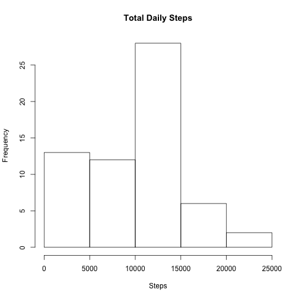
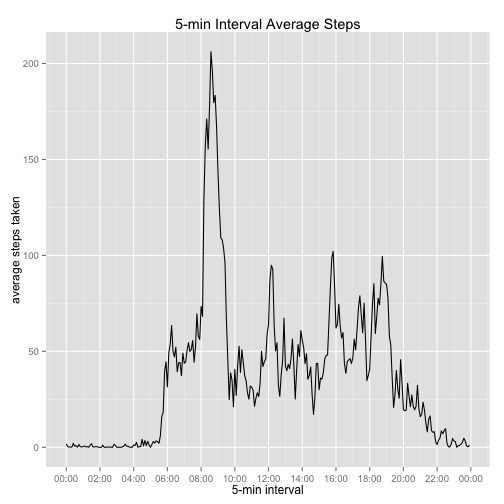
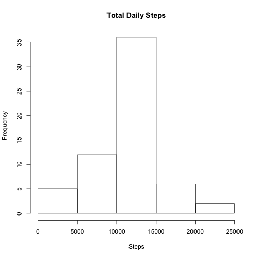

## Loading and preprocessing the data


```r
dir.create("data", showWarnings=FALSE)   # create folder ./data if needed
unzip("activity.zip",exdir="data/")   # unzip the provided zip data file
df <- read.csv("data/activity.csv", header=TRUE, na.strings="NA")   # load data from csv file
df$date <- as.Date(df$date,"%Y-%m-%d")   # column date as type Date
```

## What is mean total number of steps taken per day?


```r
library(plyr)
dft <- ddply(df, "date", summarise, steps = sum(steps, na.rm=TRUE))   # daily data summary
hist(dft$steps, main="Total Daily Steps", xlab="Steps")   # plot histogram of total daily steps
```

 


```r
mean_steps <- mean(dft$steps)
median_steps <- median(dft$steps)
```

Mean of the total number of steps taken per day: 9354.2295082  
Median of the total number of steps taken per day: 10395  

## What is the average daily activity pattern?


```r
library(ggplot2)   
library(plyr)
library(scales)
df5 <- ddply(df, "interval", summarise, steps = mean(steps, na.rm=TRUE))   # interval data summary
df5$int <- strptime(sprintf("%04d",df5$interval), "%H%M")   # column for time series
## plot
g <- qplot(df5$int, df5$steps, df5, geom="line",
           main="5-min Interval Average Steps", 
           xlab="5-min interval",ylab="average steps taken")
g + scale_x_datetime(breaks = date_breaks("2 hours"), labels = date_format("%H:%M"))
```

 


```r
busy_interval <- format(df5[which.max(df5$steps),]$int, "%H:%M")
```

08:35 is the 5-minute interval which contains the maximum number of steps on average across all the days in the dataset.

## Imputing missing values


```r
missing <- which(is.na(df$steps))
missing_len <- length(missing)
```

There are a total of 2304 missing values in the data set.


```r
dff <- df   # copy of original dataset
for(i in missing) {   # fill missing data with the mean for the 5-min interval
  if(is.na(dff[i,]$steps)) dff[i,]$steps <- df5[df5$interval==dff[i,]$interval,]$steps
}
```


```r
library(plyr)
dfft <- ddply(dff, "date", summarise, steps = sum(steps, na.rm=TRUE))   # daily data summary
hist(dfft$steps, main="Total Daily Steps", xlab="Steps")   # plot histogram of total daily steps
```

 


```r
mean_steps_f <- mean(dfft$steps)
median_steps_f <- median(dfft$steps)
```

Mean of the total number of steps taken per day: 1.0766189 &times; 10<sup>4</sup>  
Median of the total number of steps taken per day: 1.0766189 &times; 10<sup>4</sup>  

By filling the missing values the median and mean have the same value.

## Are there differences in activity patterns between weekdays and weekends?


```r
dff$day <- NA
dff$day[weekdays(dff$date) %in% c("Saturday","Sunday")] <- "weekend"
dff$day[!weekdays(dff$date) %in% c("Saturday","Sunday")] <- "weekday"

dff5 <- ddply(dff, c("interval","day"), summarise, steps = mean(steps, na.rm=TRUE))   # interval data summary
dff5$int <- strptime(sprintf("%04d",df5$interval), "%H%M")   # column for time series

library(lattice)
xyplot(steps ~ interval | day, data = dff5, layout=c(1,2),type="l")
```

 
